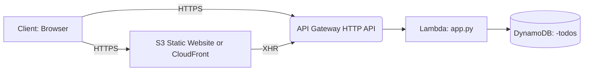

serverless to-do app
# sam-tiny-api-jcm

[](https://github.com/jmac052002/sam-tiny-api-jcm/actions)

Serverless **to‑do API** with a simple static frontend, built to showcase **AWS Solutions Architect / DevOps** skills: **API Gateway (HTTP), AWS Lambda (Python 3.12), DynamoDB (PAY_PER_REQUEST), S3 static site (or CloudFront)**, and **GitHub Actions with OIDC** for deploys (no long‑lived AWS keys).

> 👀 **Live demo links** (fill in):  
> - **Frontend:** `https://<your-cloudfront-or-s3-website-domain>`  
> - **API Base URL:** `https://<api-id>.execute-api.<region>.amazonaws.com`

---

## 📸 Overview

This project contains:
- `app.py` – Lambda handler implementing a minimal CRUD JSON API
- `template.yaml` – AWS SAM/CloudFormation template for API Gateway + Lambda + DynamoDB
- `index.html` – Basic single‑file frontend that calls the API
- `.github/workflows/deploy.yml` – CI/CD to build & deploy backend and upload the frontend to S3
- `samconfig.toml` – Non‑interactive SAM deploy configuration

### 🏗️ Architecture (Mermaid)


---

## ✨ Features

- CRUD to‑do items: `POST /todos`, `GET /todos`, `GET /todos/{id}`, `PUT /todos/{id}`, `DELETE /todos/{id}`
- JSON responses; CORS enabled for the static frontend
- IaC with AWS SAM; one‑command deploys
- GitHub Actions **OIDC** deploy (no access keys) + S3 upload step for the frontend

---

## 🧪 Quick start (local)

```bash
# Python 3.12 recommended
python3 -m venv .venv && source .venv/bin/activate
pip install --upgrade pip aws-sam-cli

# Start the API locally
sam build
sam local start-api
# In another shell:
curl -s http://127.0.0.1:3000/todos | jq .
```

---

## 🚀 Deploy (manual, once)

```bash
# Configure AWS credentials (or use a role)
aws configure
sam build
sam deploy --guided
```
This will create the DynamoDB table, Lambda, and HTTP API. Copy the **API URL** from the outputs.

Upload the `index.html` to your S3 static site or CloudFront origin bucket and set the `API_BASE_URL` inside `index.html` if you’re templating it.

---

## 🤖 CI/CD (GitHub Actions with OIDC)

This repo uses a single workflow: **`.github/workflows/deploy.yml`**.

Required GitHub **Secrets / Variables** (match your workflow):
- `AWS_REGION` – e.g. `us-east-1`
- `AWS_ROLE_TO_ASSUME` – IAM role ARN that your GitHub OIDC trust policy allows
- `FRONTEND_BUCKET` – S3 bucket name to upload `index.html` (or the site files)

High level steps:
1. Checkout repo
2. Configure AWS credentials with OIDC
3. `sam build && sam deploy` for the backend
4. `aws s3 cp index.html s3://$FRONTEND_BUCKET/index.html` to update the frontend

> Tip: To show the **build badge** above, the workflow file name must be `actions/workflows/deploy.yml`.

---

## 🔐 Security Notes

- OIDC avoids long‑lived keys. Ensure the IAM role trust policy restricts to this repo:  
  `repo:jmac052002/sam-tiny-api-jcm:ref:refs/heads/main`
- DynamoDB uses **PAY_PER_REQUEST** billing; no credentials stored in code
- CORS is limited to the frontend origin (update headers in `app.py` as needed)

---

## 🗂️ Project Structure

```
.
├─ .github/workflows/deploy.yml
├─ app.py
├─ index.html
├─ samconfig.toml
└─ template.yaml
```

---

## 🧰 Tech Stack

- **Compute:** AWS Lambda (Python 3.12)  
- **API:** API Gateway (HTTP API)  
- **Data:** DynamoDB (PK: `id`)  
- **Frontend:** S3 static site (optionally behind CloudFront)  
- **IaC:** AWS SAM / CloudFormation  
- **CI/CD:** GitHub Actions with OIDC

---

## 🧩 API Examples

```bash
# Create
curl -X POST "$API_BASE/todos" -d '{"title":"read docs"}' -H "Content-Type: application/json"

# List
curl "$API_BASE/todos"

# Update
curl -X PUT "$API_BASE/todos/<id>" -d '{"title":"updated"}' -H "Content-Type: application/json"

# Delete
curl -X DELETE "$API_BASE/todos/<id>"
```

---

## 🖼️ Screenshots

Add screenshots/GIFs of:
- GitHub Actions successful run
- Frontend working with your API URL
- DynamoDB table with items

---

## 💸 Cost

On free tiers and low usage, this costs **pennies** per month: Lambda invocations + DynamoDB PAY_PER_REQUEST + S3 storage/egress.

---

## 📜 License

MIT – see **LICENSE**.

---

## 🙋🏽‍♂️ Author

Built by [jmac052002](https://github.com/jmac052002).
